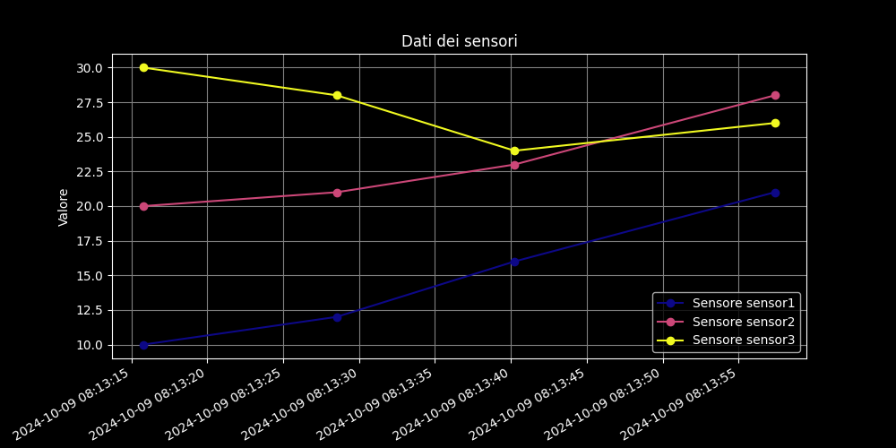

# streaming-graph
Simple python program that expose a web server to receive and plot (sensor) data points



# Installation and requirements

This program is tested on `python 3.9`.

To install dependencies, run `pip3 install -r requirements.txt`

# How to run this program

Simply run `python3 plot.py` and let it run in the background. 

NOTE ON PERSISTENCY: All received datapoints will be saved in a `sqlite` db under `data/` and loaded on application restart.

## Adding new datapoints

### For just one data point

```
curl -X POST -H "Content-Type: application/json" -d '{"sensors": {"sensor1": 15}}' http://localhost:5000/data
```

### For two or more data points

```
curl -X POST -H "Content-Type: application/json" -d '{"sensors": {"sensor1": 10, "sensor2": 20, "sensor3": 30}}' http://localhost:5000/data
```

## Plotting the resutls

Just visit [http://localhost:5000/plot](http://localhost:5000/plot)